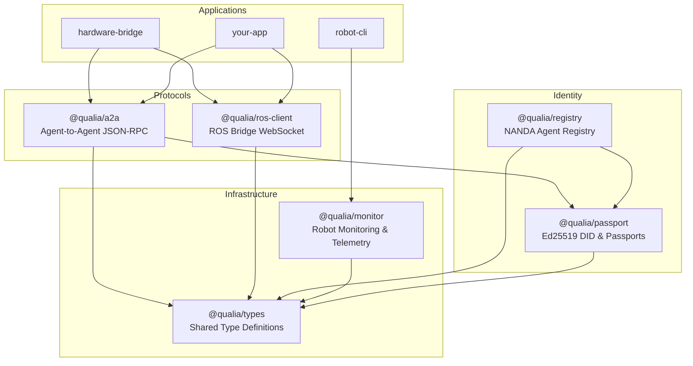
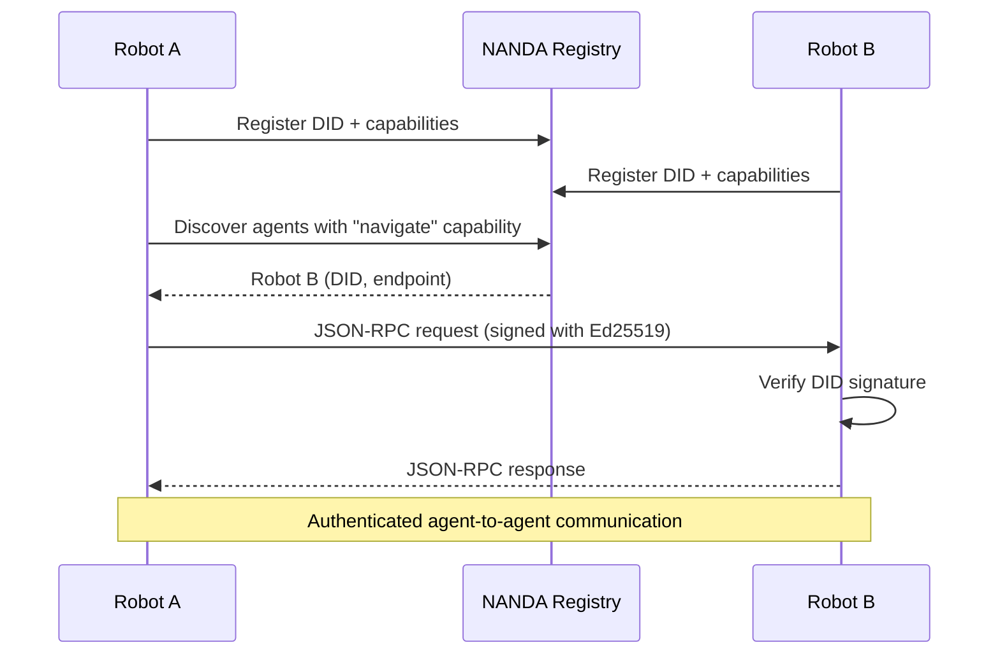
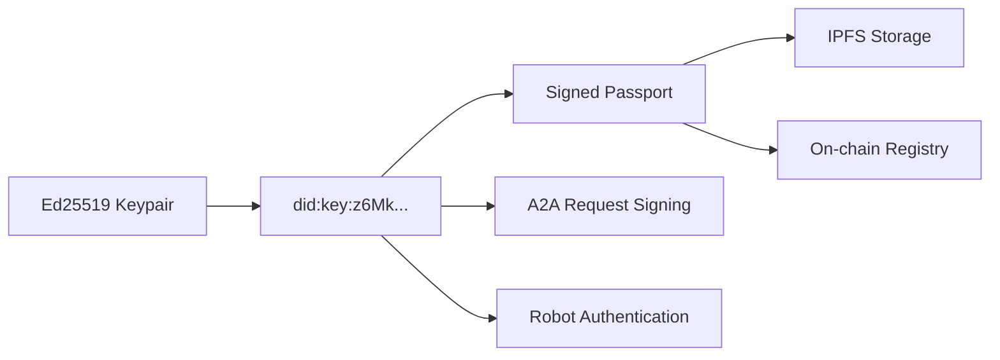
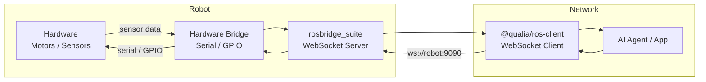

# QUALIA

Open robotics framework — A2A protocol, DID identity, ROS integration for robots and AI agents.

**TypeScript/Bun monorepo** for building networked robot systems with decentralized identity and inter-agent communication.

## Packages

| Package | Description |
|---|---|
| `@qualia/types` | Shared type definitions (NANDA, DID, A2A, ROS, capabilities) |
| `@qualia/passport` | Ed25519 identity — DID generation, passport signing, verification |
| `@qualia/a2a` | Agent-to-Agent JSON-RPC protocol with DID authentication |
| `@qualia/ros-client` | ROS Bridge WebSocket client (topics, services, auto-reconnect) |
| `@qualia/registry` | NANDA agent registry — on-chain registration and discovery |
| `@qualia/monitor` | Robot monitoring — SSH, network scanning, ROS2 status, telemetry |

## Apps

| App | Description |
|---|---|
| `@qualia/hardware-bridge` | Generic robot hardware bridge — translates ROS commands to serial/GPIO |
| `robot-cli` | Python CLI for robot management |

## Quick Start

```bash
# Install dependencies
bun install

# Build all packages
bun run build

# Run tests
bun run test

# Typecheck
bun run typecheck
```

## Architecture



## A2A Protocol Flow



## Identity System



## ROS Integration



## Supported Robots

The hardware bridge uses a driver/plugin system. Write a driver for any robot platform:

- Differential drive (e.g., Waveshare UGV)
- Ackermann steering
- Mecanum/omnidirectional wheels
- Custom serial/GPIO/I2C/CAN protocols

## Development

```bash
# Start a specific package in dev mode
bun run dev --filter=@qualia/ros-client

# Run tests for a specific package
bun run test --filter=@qualia/a2a

# Format code
bun run format
```

## License

MIT
