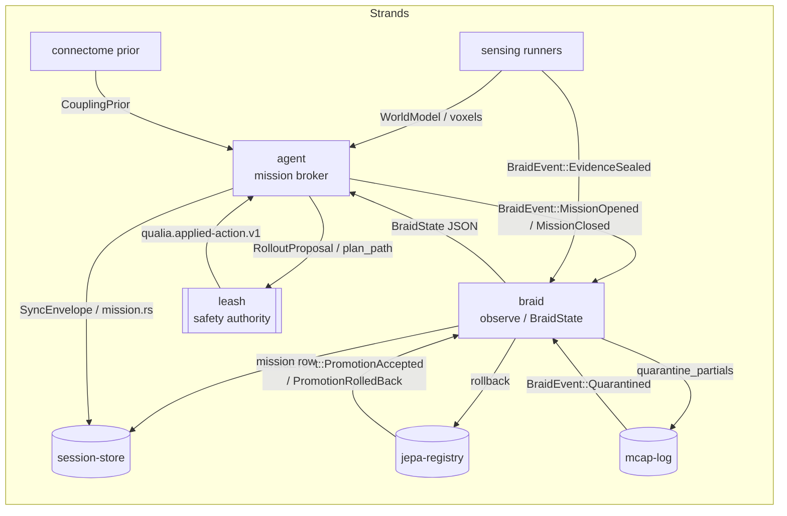
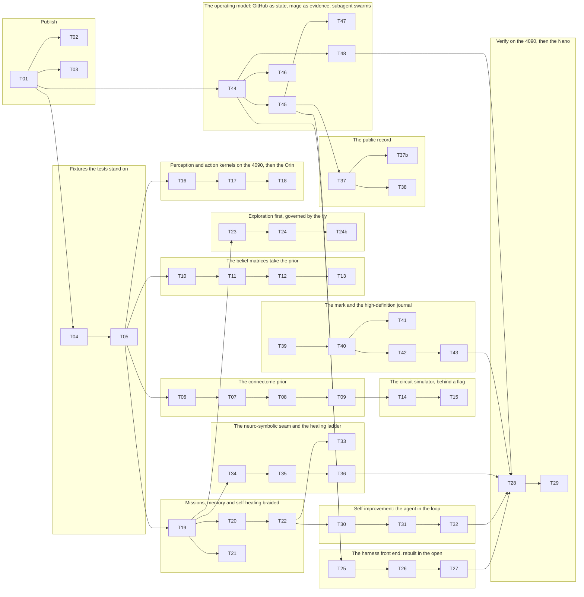
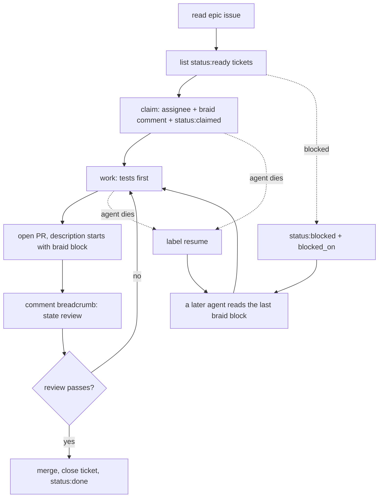
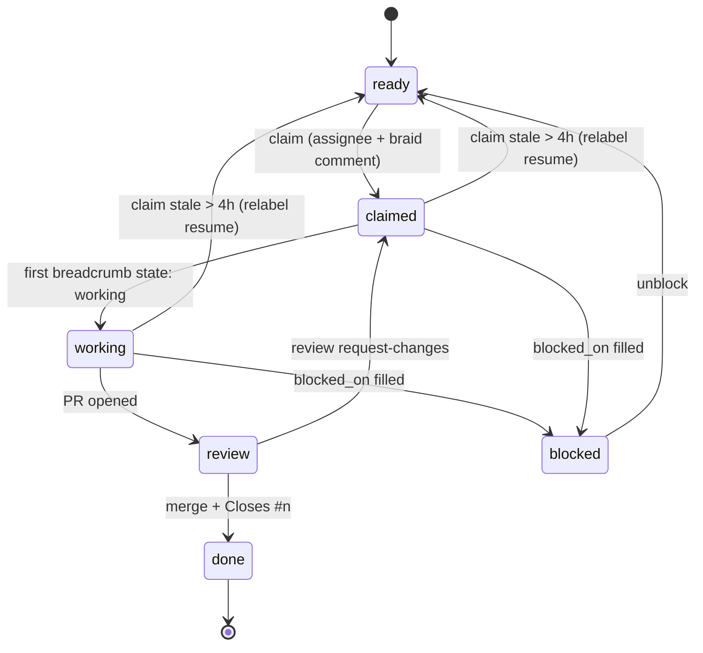
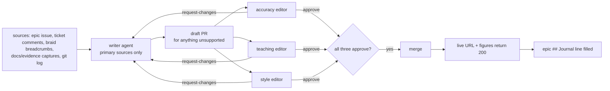

# Qualia

A **golden braid**: a fly-governed, self-healing mission harness. Evidence seals, memory records,
gated promotion, a mission broker and a bounded healing ladder — each strand reporting through one
state machine. Qualia is its first instance, not its only one: the pattern is the reusable part, so a
second braid is a copy of the pattern rather than a fork of this repository.

Development and verification run on an RTX 4090; the deployment target is the Jetson Orin Nano with
8 GB of VRAM (`sm_87`).

## What the harness delivers

Missions. Self-healing is an explicit ladder rather than an accident of rollback, and every mission
is brokered, evidenced and promoted through the same state machine.

| Strand | Crate / runner | What it contributes |
| --- | --- | --- |
| Evidence seals | `crates/mcap-log` | Crash-safe MCAP segments; partials quarantine, never lost. |
| Memory records | `crates/session-store` | SQLite sessions, epochs, missions, coupling scale. |
| Gated promotion | `crates/jepa-registry` | Candidate generation, evidence gates, atomic pointer swap. |
| Mission broker | `runners/agent` | Missions open, close, and reach Leash through `QUALIA_LEASH_BASE_URL`. |
| Healing ladder | `crates/braid` | Drift measurement, rules, and the ladder. |
| The fly | `crates/connectome-prior`, `crates/fly-circuit` | Male CNS connectome as a prior on the belief matrices; circuit simulation behind a flag. |
| Neuro-symbolic seam | `crates/braid` | The measured distance between latent and prediction is the join. |

## Architecture

`braid.mmd` — the strands, each edge labelled with the type that crosses it.

```mermaid
flowchart LR
  subgraph strands[Strands]
    SS[(session-store)]
    MCAP[(mcap-log)]
    REG[(jepa-registry)]
    BR[braid\nobserve / BraidState]
    AG[agent\nmission broker]
    LEASH[[leash\nsafety authority]]
    PRIOR[connectome prior]
    SENSE[sensing runners]
  end

  SENSE -- "WorldModel / voxels" --> AG
  PRIOR -- "CouplingPrior" --> AG
  AG -- "BraidEvent::MissionOpened / MissionClosed" --> BR
  SENSE -- "BraidEvent::EvidenceSealed" --> BR
  REG -- "BraidEvent::PromotionAccepted / PromotionRolledBack" --> BR
  MCAP -- "BraidEvent::Quarantined" --> BR
  BR -- "mission row" --> SS
  BR -- "quarantine_partials" --> MCAP
  BR -- "rollback" --> REG
  AG -- "SyncEnvelope / mission.rs" --> SS
  AG -- "RolloutProposal / plan_path" --> LEASH
  LEASH -- "qualia.applied-action.v1" --> AG
  BR -- "BraidState JSON" --> AG
```

`epics.mmd` — the ticket dependency graph. Arrows point from blocker to blocked.

```mermaid
flowchart LR

  subgraph E1["Publish"]
    T01
    T02
    T03
  end
  subgraph E2["Fixtures the tests stand on"]
    T04
    T05
  end
  subgraph E3["The connectome prior"]
    T06
    T07
    T08
    T09
  end
  subgraph E4["The belief matrices take the prior"]
    T10
    T11
    T12
    T13
  end
  subgraph E5["The circuit simulator, behind a flag"]
    T14
    T15
  end
  subgraph E6["Perception and action kernels on the 4090, then the Orin"]
    T16
    T17
    T18
  end
  subgraph E7["Missions, memory and self-healing braided"]
    T19
    T20
    T21
    T22
  end
  subgraph E8["Exploration first, governed by the fly"]
    T23
    T24
    T24b
  end
  subgraph E9["Self-improvement: the agent in the loop"]
    T30
    T31
    T32
  end
  subgraph E10["The harness front end, rebuilt in the open"]
    T25
    T26
    T27
  end
  subgraph E11["The neuro-symbolic seam and the healing ladder"]
    T33
    T34
    T35
    T36
  end
  subgraph E12["The public record"]
    T37
    T37b
    T38
  end
  subgraph E13["The mark and the high-definition journal"]
    T39
    T40
    T41
    T42
    T43
  end
  subgraph E14["The operating model: GitHub as state, mage as evidence, subagent swarms"]
    T44
    T45
    T46
    T47
    T48
  end
  subgraph E15["Verify on the 4090, then the Nano"]
    T28
    T29
  end

  T01 --> T02
  T01 --> T03
  T01 --> T04
  T04 --> T05
  T05 --> T06
  T06 --> T07
  T07 --> T08
  T08 --> T09
  T05 --> T10
  T10 --> T11
  T11 --> T12
  T12 --> T13
  T09 --> T14
  T14 --> T15
  T05 --> T16
  T16 --> T17
  T17 --> T18
  T05 --> T19
  T19 --> T20
  T19 --> T21
  T20 --> T22
  T19 --> T23
  T23 --> T24
  T24 --> T24b
  T44 --> T25
  T45 --> T25
  T25 --> T26
  T26 --> T27
  T27 --> T28
  T32 --> T28
  T36 --> T28
  T43 --> T28
  T48 --> T28
  T28 --> T29
  T22 --> T30
  T30 --> T31
  T31 --> T32
  T22 --> T33
  T19 --> T34
  T34 --> T35
  T35 --> T36
  T45 --> T37
  T37 --> T37b
  T37 --> T38
  T39 --> T40
  T40 --> T41
  T40 --> T42
  T42 --> T43
  T01 --> T44
  T44 --> T45
  T44 --> T46
  T45 --> T47
  T44 --> T48
```

`agents.mmd` — the operating loop, including the failure edge.

```mermaid
flowchart TD
  A[read epic issue] --> B[list status:ready tickets]
  B --> C[claim: assignee + braid comment + status:claimed]
  C --> D[work: tests first]
  D --> E[open PR, description starts with braid block]
  E --> F[comment breadcrumb: state review]
  F --> G{review passes?}
  G -- yes --> H[merge, close ticket, status:done]
  G -- no --> D
  C -. "agent dies" .-> X[label resume]
  D -. "agent dies" .-> X
  X --> Y[a later agent reads the last braid block]
  Y --> D
  B -. "blocked" .-> Z[status:blocked + blocked_on]
  Z --> Y
```

`states.mmd` — the ticket state machine over the `status:*` labels.

```mermaid
stateDiagram-v2
  [*] --> ready
  ready --> claimed: claim (assignee + braid comment)
  claimed --> working: first breadcrumb state: working
  working --> review: PR opened
  review --> done: merge + Closes #n
  review --> claimed: review request-changes
  working --> blocked: blocked_on filled
  claimed --> blocked: blocked_on filled
  blocked --> ready: unblock
  claimed --> ready: claim stale > 4h (relabel resume)
  working --> ready: claim stale > 4h (relabel resume)
  done --> [*]
```

`journal.mmd` — the publishing pipeline.

```mermaid
flowchart LR
  SRC[sources: epic issue, ticket comments, braid breadcrumbs,\ndocs/evidence captures, git log] --> WR[writer agent\nprimary sources only]
  WR --> DRAFT[draft PR\n<!-- ASK: --> for anything unsupported]
  DRAFT --> ACC[accuracy editor]
  DRAFT --> TEA[teaching editor]
  DRAFT --> STY[style editor]
  ACC -- "request-changes" --> WR
  TEA -- "request-changes" --> WR
  STY -- "request-changes" --> WR
  ACC -- "approve" --> GATE{all three approve?}
  TEA -- "approve" --> GATE
  STY -- "approve" --> GATE
  GATE -- yes --> MERGE[merge]
  MERGE --> LIVE[live URL + figures return 200]
  LIVE --> EPIC[epic ## Journal line filled]
```

The `.mmd` files under [`docs/architecture/`](docs/architecture/) are the source; the blocks above are
copies of them.

## Working in this repository

GitHub is the state. An epic is an issue, a ticket is an issue, a claim is an assignee plus a `braid`
comment, and a handoff is a comment any later agent can parse. See
[`docs/agents.md`](docs/agents.md), [`docs/waves.md`](docs/waves.md), and
[`docs/decisions.md`](docs/decisions.md).

## Journal

Entries are written as their tickets land, not reconstructed afterwards.

| Entry | Epic |
| --- | --- |
| the licence and the snapshot | [EPIC-01](https://github.com/superposition/qualia/issues/1) |
| the connectome as a prior | [EPIC-02](https://github.com/superposition/qualia/issues/2), [EPIC-03](https://github.com/superposition/qualia/issues/3) |
| the fly in the belief matrices | [EPIC-04](https://github.com/superposition/qualia/issues/4), [EPIC-05](https://github.com/superposition/qualia/issues/5), [EPIC-06](https://github.com/superposition/qualia/issues/6) |
| the agent in the loop | [EPIC-07](https://github.com/superposition/qualia/issues/7), [EPIC-08](https://github.com/superposition/qualia/issues/8), [EPIC-08B](https://github.com/superposition/qualia/issues/9) |
| the front end, rebuilt from lessons | [EPIC-09](https://github.com/superposition/qualia/issues/10) |
| the ladder | [EPIC-08C](https://github.com/superposition/qualia/issues/11) |
| the public record | [EPIC-09B](https://github.com/superposition/qualia/issues/12) |
| the mark | [EPIC-11](https://github.com/superposition/qualia/issues/13) |
| the operating model | [EPIC-12](https://github.com/superposition/qualia/issues/14) |
| the 4090 and the Nano | [EPIC-10](https://github.com/superposition/qualia/issues/15) |

## Licence

Apache-2.0. See [`LICENSE`](LICENSE) and [`NOTICE`](NOTICE). This repository is a clean-room rewrite:
no file is copied from any private repository.
