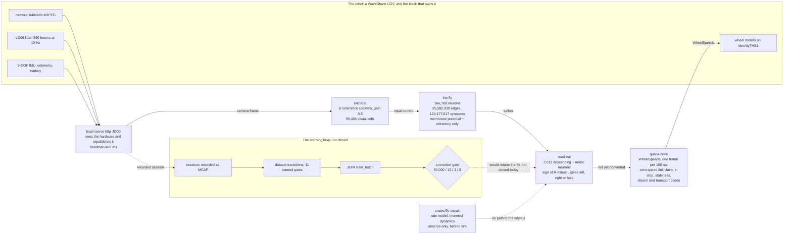

# The fly brain on the robot

**The claim.** The robot is a WaveShare UGV (an unmanned ground vehicle), and one service on its own
computer, the **leash**, owns
all of it: the motors, the LD06 lidar, the camera, the inertial unit. The name is the analogy — a leash
is what keeps a body on a lead — and that ownership is what makes a
brain safe to attach — the leash serves the sensors over HTTP and holds the motor link as a
single-owner serial port, so nothing else can open it. We put a fly's nervous system in that loop. The
released FlyEM male-CNS connectome — the wiring diagram, 166,700 neurons and 25,582,938 edges carrying
124,177,617 synapses (`male-cns:v1.0`, CC-BY 4.0, Berg et al., *Cell*, 2026; the artifact's own
`assets/brain/connectome-cns/attribution.json`) — runs as a spiking
network on the robot's computer — one step of it is a **tick**, every neuron reading its inputs and
deciding at once — and, off the robot's own camera, produced the steering commands that
would reach the wheels: the first board run commanded 296 non-hold ticks out of 300 (197 left, 99
right, 4 hold); the fixed-reader re-run commanded 294 of 300 (98 left, 196 right, 6 hold); the host
run against the same camera commanded 196 of 200 (130 left, 66 right, 4 hold), at 112.7 ticks/s. The
wiring runs. It does not learn, and its commands stopped at a trace file rather than a wheel.

A **neuron** is a cell that carries a signal; a **synapse** is the junction where one neuron passes it
to the next; a **connectome** is a map of both, read out of an electron-microscopy volume. This
release is a male fly's central nervous system — the brain and the ventral nerve cord together — which
matters here because the motor neurons are in it: a camera frame can reach a motor decision inside the
network instead of stopping at a brain and being handed to someone else's controller. The network runs
as a **spiking** model: every neuron holds a **membrane potential** (the voltage accumulated from its
inputs), fires a **spike** (a brief, all-or-nothing pulse) when the potential crosses a threshold, and
then sits out a **refractory** period. The **leash** is the board-side process that owns the hardware; a
**deadman** is a watchdog that stops the motors if commands stop arriving (the leash holds its own at
400 ms); the **arena** is the shared-memory region our runners publish into and read; **MCAP** is the
container format our recorder writes. **JEPA** is a world-model trainer: it learns to predict the next
observation from the current one and the action taken, rather than reconstructing pixels. A
**promotion gate** is the checkpoint a dataset must pass to be trained on at all. **Plasticity** is
any change to a synapse's strength from experience; **neuromodulation** is a chemical signal that
changes how a circuit behaves; the network below has neither.

*(The parenthesised codes throughout are this project's own pointers: `#N` and `PR #N` are GitHub
issues and pull requests, `Txx` are tickets, and `D-0xx` are records in `docs/decisions.md`.)*

## What we tried

The robot's loop is four programs on two machines. The leash runs on the robot's own computer and owns
the hardware; our runners run on it too, or on a workstation pointed at it. The leash serves the camera
as MJPEG and a single JPEG snapshot, the lidar as a range-scan tool over HTTP, the inertial unit as
`sensors.imu`, and the motors over a serial link the leash holds — `/dev/ttyTHS1` at 115200 baud, its
own deadman at 400 ms (`LEASH_DEADMAN_MS`). A second opener of either serial port is refused
(`errno` 16); the camera node takes several readers, but the stack still subscribes to the leash's HTTP
surface rather than opening it, because a second opener is a second owner (D-025; `#240`, `T59`).

**The motor path is safety-shaped by construction, and that is the point.** We care about those
properties more than the control law: a path that cannot fail silently is the only kind a brain should
be allowed near. The runner that turns a goal into motion is `qualia-drive` (`runners/drive`). Each
100 ms tick it reads the newest pose and scan from the shared arena, resolves the active navigation
goal into one
`DriveCommand::WheelSpeeds { left, right }`, and writes one newline-terminated JSON frame —
`{"T":1,"L":l,"R":r}` — to the serial link. Around that command sit gates in precedence order: a
latching e-stop file, a pose or scan older than 1,500 ms, an inactive goal, a blocked front arc at
0.48 m, a goal with under 0.10 m of progress in 5 s, and arrival. Wheel commands are clamped to 0.34
and turns to 0.20. A disarmed runner never writes the link at all; its published interval carries zero
applied speed plus `ACTION_SAFETY_DISARMED`, and a write that fails carries `ACTION_SAFETY_TRANSPORT_ERROR`.
At startup, while armed, it claims the link at zero speed before any goal can be honoured. Arming is
deliberately strict: only `1`, `true`, `TRUE`, `yes`, `YES` are consent, so a typo leaves the motors
disarmed.

**Then we ran the fly as the controller.** The released tables import into a checkable artifact and
the network steps with the release's own wiring and signs (`crates/connectome-cns`, `#236`). It is a
sparse leaky integrate-and-fire model — membrane potential and a refractory counter, nothing else. The
encoder is fixed: eight luminance columns from one camera snapshot per tick, gain 0.5, injected into
95,494 visual-stage cells (`ol_intrinsic` plus `R1-R6`/`R7`/`R8`). The read-out is fixed too: 2,012
released descending and motor neurons, split 1,011 left and 1,001 right, and the command is the sign
of the right-minus-left firing rate against a 0.001 dead band — left, right, or hold, plus a throttle
that is the total output rate. Nothing is fitted and nothing is trained. On the robot's own computer
the bare step is 11.840 ms/tick (84.5 ticks/s) and the closed loop over the leash's camera ran at
31–32 ticks/s. That left/right/hold is the connectome's own read-out, not yet the robot's motor path:
`qualia-drive` writes `DriveCommand::WheelSpeeds` from a `NavGoal`, and nothing yet converts the fly's
command into one. The loop's command went to its trace CSV and no further.

**Almost nothing in this epic failed by crashing.** It failed by working and reporting something that
was not true, and a second opinion — a file read back, a number probed directly — caught it every
time. The ones worth keeping are the ones that taught something about driving and learning.

**A reader skipped four bytes too many.** A spike-stream frame is `tick u64 | t_ns u64 | count u32 |
ids u32[]` behind an **8-byte** header (magic, `u16` version, `u16` reserved), but the reader skipped
the 12-byte base header the weights and positions files use. It desynced on the first frame and
refused every stream; the writer had always been right, so only the reading was broken. The bench log
shows how it looked — `frame 83464099482600 ids are not strictly ascending` — and the board loop had to
be re-run with the fixed reader under a written lease to commit a transcript that reads back (`#236`).
*The rule we took: header layouts differ per file, so each format is parsed from its own description,
and what was written is read back — a correct writer is not evidence of a correct reader.* The loop
computes its command live and writes the trace as it goes, so the first board run's counts are its own
trace's (`board-loop-trace.csv`): the defect was in the QLSP reader's read-back of the recorded spikes,
not in the loop's own command computation, which is why `board-bench.log` is a failed re-read of that
recording and the loop was run again to commit a transcript that reads back. Both runs appear below, each labelled by the kind of record it is.

**A silent frame that fired node 0.** In the console's spike reader, the frame-header read checked its
`bool` and the ids read dropped it, so at end of file the buffer stayed zeroed; for a frame with
`count == 1`, `[0]` is strictly ascending and passed validation — a frame that looks like a spike
carrying no data. A scratch probe showed the failing arm (`Some(SpikeFrame { tick: 7, t_ns: 0, ids:
[0] })`) and the fixed one (`truncated tick 7 ids: 0 of 4 bytes`), and the guard now names the byte
counts it read (`#237`). *The rule we took: an end-of-file that reads as data is worse than an error —
a decoded frame has to name the bytes it came from.*

**A bottleneck that was never probed.** The first board loop was reported as "camera-bound" at "~33
snapshots/s", and nothing had measured either claim. When we probed the leash's own snapshot endpoint
on the board it answered 200 fetches in 2,485 ms — 80.5 snapshots/s — while the loop consumed 32.1
ticks/s, and the host loop against the same endpoint ran at 112.7 ticks/s. The board loop's 31.2 ms per
tick is 11.840 ms of step plus ~19 ms of loop. The same probe measured 2,485 ms for 200 fetches, or
12.4 ms per fetch, and the loop fetches one camera snapshot per tick: the fetch is the largest single
part of that ~19 ms. The claim that the loop was camera-bound was withdrawn
(`#236`; the review of PR #246). *The rule we took: a bottleneck that was not probed is a guess, and a
rate goes next to the thing it was measured on.*

**The learning loop is the point of the project, and it is the part that is not closed.** The idea is
plain: record the robot's real sessions, cut them into transitions — a frame, the action taken, the
next frame — and train a world model on them, so the fly's controller can be shaped by what actually
happened on the robot instead of by constants we chose. The recording side works. `qualia-arena-recorder`
writes the arena into MCAP; the dataset leg (`crates/jepa-dataset`, `#239`, `#250`) forms transitions
from camera pairs in order and runs a fixed sequence of eleven named gates over them — `frame_gap`,
`camera_invalid`, `calibration_missing`, `exposure`/`target_exposure`, `lidar_missing`,
`pose_missing`, `sensor_skew`, `lidar_invalid`, `future_occupancy_ungrounded`, `pose_confidence` and
`applied_action_missing`/`action_coverage` (`docs/evidence/T65/calibration/README.md` §1); the trainer
(`crates/jepa-model`) then takes a batch of `TransitionExample`s, encodes the observation, predicts the
future latent from the applied action, and takes a gradient step. Two real
sessions went through it. The first, `t58-real-01` (900 s, 83,299,459 B), formed 4,501 candidates and
admitted **0**, every one at `calibration_missing` — no runner in the tree produced a calibration, so a
gate the robot cannot pass was reading a number nobody wrote. The second, `t65-real-01` (300 s,
30,300,801 B), admitted **1,499 of 1,500** once a calibration producer, the pose runner, and the
leash-authority transport ledger were all real. And then the trainer refused:

```text
$ qualia-jepa-train --manifest …6f98b125….json --backend cuda --epochs 1 --batch-size 32 --seed 65
qualia-jepa-train: dataset does not meet the 50k/12-session/3-condition/3-environment gate
TRAIN_RC=1
```

That refusal is D-027, and it is the honest state of the project: 1,499 valid transitions, from 1
session, in 1 environment, under 1 condition, against a floor of 50,000 valid transitions over 12
sessions, 3 environments, 3 conditions, each at least 5 % of the corpus. The gap is 33.4× on the
count alone, before the diversity no threshold change can supply.

**What "the fly learns to drive" would mean, concretely.** Today the read-out is a rule we wrote — the
sign of the right-minus-left firing rate — so the fly never sees whether a command helped. The piece
that would close the loop is a world model of this robot's own dynamics: the trainer's `train_batch`
learns to predict the next frame's latent — a compressed representation, not the pixels — from the
current observation and the action taken, and a prediction that
knows what a wheel command does to the next frame is what a score would be computed against — did the
command move the robot toward the goal, or into the wall — and that score is what would choose the
read-out, replacing the fixed sign rule with one shaped by real sessions. We have the recorder, the
transitions, the trainer and the gates; what is missing is the corpus to train on and the objective to
train against. **The wiring runs; making it learn to drive is the work now.**

## What we changed

* **The drive path** (`runners/drive`): `DriveCommand::WheelSpeeds` resolved from a `NavGoal`, one
  `{"T":1,"L":l,"R":r}` frame per 100 ms tick over `/dev/ttyTHS1` at 115200, the link claimed at zero
  speed on arming, the e-stop and staleness and blocked-arc and stall gates in precedence order, and
  the disarm and transport-error codes instead of silence (D-025).
* **The connectome as a controller** (`crates/connectome-cns`, `qualia-connectome-cns`): the release's
  four public tables into a checkable artifact (`QLCN` weights, `QLCB` positions, cell types, nodes, a
  per-section SHA-256 manifest), a CUDA LIF kernel with a CPU version to check it against, and `bench`,
  `loop` and `replay` commands. The graph is committed at `assets/brain/connectome-cns/`; the
  180,414,198-byte `weights.bin` stays out of the tree by digest (`#236`).
* **The robot loop itself** (`runners/leash-sensors`, `runners/camera`'s MJPEG path): the two runners
  that subscribe to the leash for the stack — range scans republished through `qualia-lidar`'s own
  `publish_scan`, frames through the existing MJPEG consumer — so nothing opens a device the leash owns
  (`#240`).
* **The learning path** (`crates/jepa-dataset`, `crates/jepa-model`, `runners/calibration`,
  `runners/leash-transport`, `runners/pose`): the transition gates, the trainer's `train_batch`, a
  calibration producer whose `calibration_id` is a sha256 over measured identity fields with intrinsics
  and extrinsics recorded `unmeasured` and the reason given, and a transport ledger that records the
  leash's own acknowledgement of its zero-speed stop with `authority=leash` (`#250`).
* **The console's Brain view** (`crates/connectome-stream`, `crates/connectome-view`,
  `apps/qualia-console/src/views/brain/`): the committed graph, coloured by cell type, with the tick's
  firing set read off `QUALIA_CONNECTOME_SPIKES` on its own thread — the operator's instrument, per
  D-023 (`#237`).
* **Five decisions** (`docs/decisions.md` D-023–D-027): the console is the instrument and there is one
  agent instance per host; the board is leased in writing; the leash owns the hardware and the stack
  subscribes; committed snapshot images are re-rendered, never sided; the promotion floor stands and
  what closes it is corpus.
* **What deliberately did not change**: `crates/fly-circuit` is a **rate model over the prior's type
  graph** — one scalar state per type, invented dynamics over 5 types and 9 edges — kept behind a
  `sim` feature, observe-only, and never reachable from the motor path. The controller on the robot is
  the CNS runner above, not that crate. It is named here so the two cannot be confused.

## Evidence

The driving loop is this diagram. Its source of record is `driving-loop.mmd`, committed beside the
figures, and the entry carries the `mermaid` block, which is the form the figures convention's rule 1
names for a flow a reader follows. The two charts below are committed under
`docs/figures/the-fly-brain-on-the-robot/` with their generator and their data file, per
[`docs/figures/README.md`](https://github.com/superposition/qualia/blob/main/docs/figures/README.md).



*The diagram carries the spine: the robot's own camera reaches the leash, the leash feeds the
encoder, and the connectome's spikes become a left/right/hold decision. The dashed edges are what is
not connected: the fly's command is not yet converted into a `DriveCommand::WheelSpeeds`, and the
learning loop — real sessions recorded as MCAP, gated into a dataset, and trained — would retune the
fly but cannot yet, at 1,499 valid transitions against the 50,000-transition floor (D-027). The rate
model is drawn only to say what it is not.*

| File | Kind | What it encodes |
| --- | --- | --- |
| `drive-commands.svg` (+ `.png`) | chart | Every tick of the three closed-loop runs, as the connectome's own read-out commanded it: the first board run 197 left / 99 right / 4 hold of 300 at 31.3 ticks/s, the fixed-reader re-run 98 left / 196 right / 6 hold of 300 at 32.1 ticks/s, and the host run 130 left / 66 right / 4 hold of 200 at 112.7 ticks/s. Re-counted from each run's committed trace CSV. |
| `dataset-gate.svg` (+ `.png`) | chart | Two real sessions through the dataset's transition gates: `t58-real-01` (900 s, 83,299,459 B) with 4,501 candidates and 0 valid at `calibration_missing`, and `t65-real-01` (300 s, 30,300,801 B) with 1,500 candidates and 1,499 valid; the promotion floor (50,000 valid, 12 sessions, 3 environments, 3 conditions — 33.4× the accepted session) is stated above both. |
| `driving-loop.mmd` | diagram | The driving loop as a flow, the source the `mermaid` block above carries: the leash owning the robot's sensors and motor link, the encoder → fly → read-out path, `qualia-drive`'s wheel command, and the dashed learning path (MCAP → dataset transitions → JEPA `train_batch` → promotion gate) that is not closed today. |
| `wave-numbers.json` | data | Every number the two charts draw, each with the committed evidence file it came from; a chart value the file does not carry is a refusal, not a guess. The command counts are re-counted from the trace CSVs and a disagreement is a refusal. |


*`drive-commands.svg`: what the fly's read-out did, run by run. Bars are ticks of one run, split into
left/right/hold from each trace's own `command` column —
`docs/evidence/T55/connectome-runner/host-loop-gpu-trace.csv`,
`board-loop-trace.csv`, `board-loop-trace-rerun.csv` — and the generator refuses to draw if a trace
and the counts recorded beside it disagree. (The first board run's wall-clock, 300 ticks in 9.589 s, is
issue #236's braid comment; its trace carries counts and no clock.) The two board runs point opposite ways (197/99 and 98/196)
and we are not calling that a behaviour: the camera was pointed at a nearly uniform scene, the encoder
is a fixed mapping, and the network's recurrent dynamics dominate. Its luminance ran 0.4613–0.4679 on
the host run and 0.4662–0.4739 on the first board run. What the figure does establish is that a
left/right/hold command came out of the released wiring, at the loop's own rate, on the robot.*


*`dataset-gate.svg`: what the two captures produced, from the dataset binary's own audit lines in
`docs/evidence/T58/real-sessions/README.md` and `docs/evidence/T65/calibration/README.md`. Slate is
candidate transitions, green is admitted valid; where nothing was admitted the bar has no height and
the series is read from its `0` label. The floor above them is `docs/decisions.md` D-027 and is off
the chart: 50,000 valid transitions is 33.4× the whole accepted session, before the 12-session /
3-environment / 3-condition diversity.*

### Data

`wave-numbers.json` carries the charts' numbers with the source file each was read from; a chart value
the file does not carry is a refusal rather than a guess. The quantities, with units and sources:

| Quantity | Value | Source |
| --- | --- | --- |
| The robot | WaveShare UGV; leash `serve http` on `:8000`, profile `waveshare-ugv`; LD06 lidar on `/dev/ttyACM0`, camera on `/dev/video0`, drive on `/dev/ttyTHS1` at 115200 baud, deadman 400 ms | `docs/decisions.md` D-025; `docs/evidence/T58/real-sessions/README.md`; `docs/evidence/T59/devices/README.md` |
| Leash ownership | both serial ports single-owner: a second opener gets `errno` 16, and `qualia-lidar` / `qualia-drive` exit 2; the camera takes a second reader (`fd=3`) | `docs/evidence/T59/devices/README.md` |
| The motor path | `DriveCommand::WheelSpeeds { left, right }`; `{"T":1,"L":l,"R":r}` newline-terminated JSON per 100 ms tick; max 0.34 wheel / 0.20 turn; stale pose or scan 1,500 ms; front arc 0.48 m; 5 s with under 0.10 m is a stall; link claimed at zero speed; `ACTION_SAFETY_DISARMED` / `ACTION_SAFETY_TRANSPORT_ERROR` | `runners/drive/src/main.rs` |
| Connectome | 166,700 neurons / 25,582,938 neuron-level edges / 124,177,617 synapses; excitatory / inhibitory / unknown-sign 94,542,746 / 26,402,637 / 3,232,234; release `male-cns:v1.0`, CC-BY 4.0 | `docs/evidence/T55/connectome-runner/README.md`; `docs/evidence/T56/floating-brain/README.md` |
| Network model | sparse leaky integrate-and-fire: membrane potential and a refractory counter, no plasticity and no neuromodulation | `crates/connectome-cns/src/lif.rs`; `docs/evidence/T55/connectome-runner/README.md` |
| Encoder and read-out (chosen constants) | 8 luminance columns, gain 0.5, 95,494 visual-stage cells (`ol_intrinsic` + `R1-R6`/`R7*`/`R8*`); 2,012 descending/motor neurons, 1,011 L + 1,001 R; dead band 0.001 | `crates/connectome-cns/src/main.rs` (`GRID_COLUMNS`, `SENSORY_GAIN`, `DECISION_MARGIN`); `docs/evidence/T55/connectome-runner/README.md` §The closed loop |
| Artifact | `weights.bin` 180,414,198 B (T55); `positions.bin` 3,334,012 B, sha256 `016a285b…afa6e`, placed 139,662 of 211,577 bodies, 11,752 type labels (T56 §The artifact); 190 MB total | `docs/evidence/T55/connectome-runner/README.md`; `docs/evidence/T56/floating-brain/README.md` |
| Orin NX iGPU (sm_87 cubin) | 11.840 ms/tick, 84.5 ticks/s, 2,160.6 M synapses/s, 182,247,874 B resident | same |
| RTX 4090 (NVRTC, sm_89) — supporting | 1.381 ms/tick, 723.9 ticks/s, 18,519.0 M synapses/s | same |
| Dev host CPU (one i9-14900KF thread) — supporting | 20.615 ms/tick, 48.5 ticks/s, 1,241.0 M synapses/s | same |
| 60 Hz headroom — bench only | 16.7 ms frame vs 11.840 ms/tick = 1.41×; the closed loop ran at 31–32 ticks/s on the board, 112.7 on the host | same |
| Command distribution | first board run 197 left / 99 right / 4 hold of 300; fixed-reader re-run 98 / 196 / 6 of 300; host run 130 / 66 / 4 of 200 | each run's trace CSV under `docs/evidence/T55/connectome-runner/`; the first board run's 31.3 ticks/s and 9.589 s are issue #236's braid comment, because its trace carries counts and no clock |
| Board loop | 300 ticks in 9.358 s = 32.1 ticks/s, 15,085,686 spikes, 294 non-hold commands, 31.2 ms/tick end to end | `docs/evidence/T55/connectome-runner/board-loop.log:439` |
| Host loop | 200 ticks in 1.775 s = 112.7 ticks/s, 10,048,960 spikes | `docs/evidence/T55/connectome-runner/README.md` §The closed loop |
| Session 1 (`t58-real-01`) | 900 s; MCAP 83,299,459 B, sha256 `97612acb…3334`; camera 4,502, lidar 8,775 records; 4,501 candidates, 0 valid, all `calibration_missing` | `docs/evidence/T58/real-sessions/README.md` |
| Session 2 (`t65-real-01`) | 300 s; MCAP 30,300,801 B, sha256 `03ae6b0f…7110`; camera 1,501, lidar 2,917, pose 2,917, applied-action 2,997 records; `valid=1499 candidates=1500`; mean action coverage 1.0; mean sensor skew 29.19 ms; one candidate rejected at `action_coverage` | `docs/evidence/T65/calibration/README.md` |
| Calibration identity | `calibration_id = cac618af…f6e2`; camera intrinsics, camera↔lidar extrinsics, lidar mount transform `unmeasured` | same |
| Promotion floor | 50,000 valid transitions, 12 sessions, 3 environments, 3 conditions (each ≥ 5 % of the corpus); shortfall 33.4× | `docs/decisions.md` D-027 |
| Trainer step | `train_batch` over `TransitionExample`s: encode the observation, predict the future latent from the applied action, take one optimizer step | `crates/jepa-model/src/train.rs:169` |
| Supporting: gate parity | six output streams content-identical to the frozen Python gates after folding line endings; `provenance: OK` | `#238`; PR #253 |
| Supporting: device audit | no IMU on the robot's own I2C/IIO buses (the leash's `sensors.imu` exists); the leash's localizer reports `pose: null`, so pose is our own lidar ICP | `docs/evidence/T59/devices/README.md`; `docs/evidence/T58/real-sessions/README.md` |
| Supporting: console Brain panel | 9,976 of 139,662 placed points drawn, 3,728 of the captured tick's 36,480 firing nodes | `docs/evidence/T56/floating-brain/README.md` |

**What the figures deliberately omit.** `docs/figures/the-fly-brain-on-the-robot/` holds the two
charts and `driving-loop.mmd`, and no render: the render band of `docs/figures/README.md` rule 2 is for
an entry whose subject is a numeric field, and this one is a system. The 4090-and-Nano material appears
only as the supporting rows above; that comparison and its own figures live in the entry
`the-4090-and-the-nano`.

### Regenerating

```console
$ py -3.13 docs/figures/the-fly-brain-on-the-robot/make_figures.py
wrote drive-commands, dataset-gate; runs [('board loop, first run', (197, 99, 4), 31.3), ('board loop, fixed-reader re-run', (98, 196, 6), 32.1), ("host loop, the board's camera", (130, 66, 4), 112.7)]
```

The generator imports the house style from [`../_house.py`](../_house.py), the palette is defined
once there, two consecutive runs are byte-identical (`cmp` over each `.svg` and `.png` under
matplotlib 3.10.1), and every asset is under 400 KiB. It re-counts each run's committed trace CSV and
refuses to draw if a trace and the counts recorded beside it disagree; that is why the figure's
numbers and the prose here can be checked against each other.

**Why the loop is Mermaid and not a third SVG.** `docs/figures/README.md`'s rule 1 asks every entry
for one chart and one drawing; a `<name>.mmd` committed beside the figures is one of the forms it
names, and the entry carries its `mermaid` block. That is this entry: two charts, and `driving-loop.mmd`
as the drawing. `driving-loop.mmd` is not written by `make_figures.py` — the Mermaid block above is
its copy, so an edit is made in both — and the figures check is the gate it passes.

The gates, run in this tree:

```console
$ cargo run --quiet -p qualia-gates -- figures
figures: OK (11 entries, 53 figures, 400 KiB budget)
$ cargo run --quiet -p qualia-gates -- provenance
provenance: compared 152 authored file(s) (1 generated skipped); 0 identical, 27 EOL-identical, 7 code runs over 20, 0 prose runs over 2
provenance: highest identical-code-line share 1.000 (.cargo/config.toml)
provenance: OK
```

## What this does not establish

**The loop ran; it did not drive.** No wheel of this robot was turned by this epic. The connectome's
`command` and `throttle` went to its trace file, and the only command the robot's own transport ledger
records is the leash's zero-speed stop — `{"left":0.0,"max_speed":0.35,"ok":true,"right":0.0,…}`,
3,100 intervals accepted with every speed `0.000` (`docs/evidence/T65/calibration/README.md` §4).
`runners/drive` could not have opened `/dev/ttyTHS1` — the leash holds it (`errno` 16) — so the drive
path's success branch is not exercised on this robot by design. What is established is that the
connectome produced left/right/hold commands from the robot's own camera at the loop's own rate.

* **Nothing here learns.** The network is membrane potential and a refractory count: no plasticity, no
  neuromodulation, no training. The monoamines and unknown-sign transmitters get sign 0 rather than an
  invented polarity, and a free-running network is silent because there is no noise term; the drive is
  what makes it spike. The JEPA trainer exists and its step is real, but no checkpoint has been
  promoted, so nothing it has learned (or failed to learn) is in the loop.
* **The promotion floor is unmet, and it is corpus, not code.** 1,499 valid transitions in 1 session,
  1 environment and 1 condition against 50,000 / 12 / 3 / 3 (D-027). That is the next bottleneck:
  more sessions, in more places, under more conditions — not more kernels. On this robot the motor
  authority belongs to the leash, so a driven session is a leash decision, not a runner flag.
* **The encoder and read-out are chosen constants, not a fit.** Eight luminance columns, gain 0.5,
  95,494 visual cells in and 2,012 motor neurons out are fixed choices, and the read-out's sign rule is
  stated rather than learned. The camera was pointed at a nearly uniform scene (luminance
  0.4613–0.4679 on the host run, 0.4662–0.4739 on the first board run, 0.381–0.384 in the T65 session),
  so the frame contributed little and the network's recurrent dynamics dominate. The loop is plumbing
  and a read-out, not a behaviour claim.
* **The two board runs disagree, and that is a fact about the runs, not a result.** 197/99 and 98/196
  are different command splits from the same artifact and the same read-out rule, in different lighting,
  with the first run's recording never read back (the spikes reader was broken; its trace is what it
  commanded). Neither is a distribution.
* **60 Hz bounds the bench, not the loop.** 16.7 ms is a 60 Hz frame and the free-running step is
  11.840 ms; the closed loop as run was 31–32 ticks/s on the board and 112.7 ticks/s on the host, each
  with its own conditions. No 60 Hz claim is made for the loop.
* **`crates/fly-circuit` is not the controller.** It is a rate model over the prior's 5-type, 9-edge
  graph with invented dynamics, behind a `sim` feature, observe-only, and never reachable from the
  motor path. Nothing in this entry's driving numbers comes from it.
* **The console brain figure is one host's wgpu render.** The committed panel is rendered headlessly on
  this workstation; the board's renderer is a separate leg and was not run. The cloud draws the 139,662
  somata the release places of 211,577 bodies, decimated to 10,000 points, and the firing overlay is
  strided — so the figure shows 9,976 points and 3,325–3,730 firing nodes, not the whole network.
* **The live `tcp://` spike path is unexercised.** The recorded file is the path the figures and the
  console exercise; the socket framing carries the same bytes but has only been checked over a local
  socket, never across the USB link to the board.
* **The firing stream the console draws is not in the tree.** `spikes.bin` — 40,199,848 B, sha256
  `a0a27acb…3b28` — is a recording, deliberately not committed; the committed console figure and the
  firing figures were produced by pointing `QUALIA_CONNECTOME_SPIKES` at it (T55 §What was run, T56
  §The stream this figure shows).
* **The lidar and drive success paths are unexercised on the robot.** The board rows measure the
  *refusal* — `Device or resource busy`, exit 2 — which is the documented contract for a port the leash
  owns; the scan-assembly and motor-write paths behind a successful open cannot be exercised without
  taking a port from the leash, which D-025 rules out.
* **The driver in front of the dataset is ours, and two of its defects were real.** The manifest
  failed its own digest because `serde_json`'s best-effort float reader read the audit's
  `mean_sensor_skew_ns` literal `29192462.559039358` one ulp low and the digest is taken over the
  re-serialized struct; `serde_json/float_roundtrip` fixed it (D-027, PR #257). The trainer command
  quoted in "What we tried" is the post-fix refusal T52/promoted-e2e records, run on the dev host (WSL2
  Ubuntu-22.04, RTX 4090); the T65 transcript before the fix carries the digest error instead
  (`docs/evidence/T65/calibration/README.md` §7, `docs/evidence/T52/promoted-e2e/digest-fix/trainer-after.txt`).
* **Session 1's zero is a missing producer, not a bad robot.** `calibration_missing` rejected all 4,501
  candidates because no runner in the tree wrote a `calibration_id`; that is a finding about our
  software, and it is why session 2, with the producer, reached 1,499.
* **The hardware audit leaves gaps it names.** No IMU is on the robot's own I2C/IIO buses (the leash's
  `sensors.imu` exists, but the arena has no inertial slot and no runner consumes it); the leash's
  localizer never came up, so pose is our own lidar ICP on a stationary scene; `qualia-vslam` and
  `qualia-jepa-runtime` were not built or run in that pass (D-023).
* **The charts round and encode single sessions.** Bar labels are to four significant figures and the
  floor is drawn as an annotation, not a bar, because it is 33.4× off the scale; the diagram's numbers
  are the two sessions' own, not a distribution.
* **The published page is a site step.** This README and its figures are the source; the site's front
  matter and live URL are produced from them when the entry moves to the site's `_posts/`.
